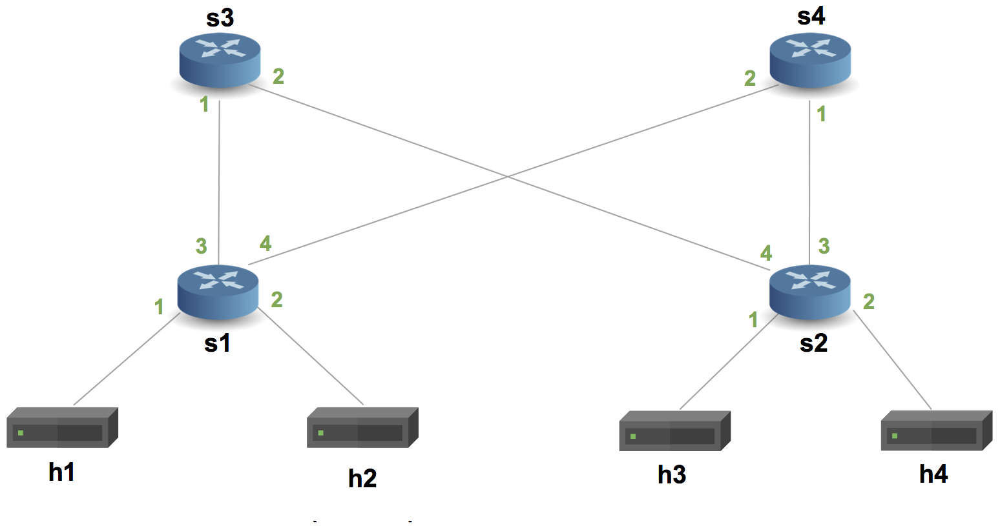

# P4 demo
执行 `make build` 命令之后，回搭建起如下图所示的网络



runtime/ 文件夹下存储的是交换机的静态表项，这些静态表项可以支持 h1 ping 通 h2。

p4Controller.py 演示了如何通过 grpc 下发流表，h1 可以 ping 通 h4。


## bmv2 是如何被加载到mininet中的
1. 执行 make run，执行当前文件夹下的 Makefile

2. 当前文件夹下的 Makefile 设置完几个变量之后，调用 utils/Makefile

3. run 依赖于 build，因此先执行 build

4. build 依赖于 `dirs $(compiled_json)` ，此依赖触发了 `%.json: %.p4`

5. `%.json: %.p4` 用 p4c-bm2-ss 将当前文件夹下所有的 .p4 文件编译为 json 输出到 build/ 文件夹下

6. 完成了 build 目标，继续执行  run

7. run 调用了一个 python2 脚本 utils/run_exercise.py，这个脚本负责生成 mininet 网络，并接管了 mininet 的 CLI

8. utils/run_exercise.py 的执行逻辑：

    解析命令行参数，根据命令行参数创建 sw 类、host类和link类

    通过 addSwitch() addHost() addLink() 函数将网络设备加入到网络并连接起来

9. mininet 加载 ovs 和 bmv2 的原理是一样的

    ovs 和 bmv2 本来就是可执行文件，他们只需要满足 mininet 的几个要求，就可以作为网络设备加载进来


## 三类文件的作用 
本工程主要通过以下三个文件实现对网络的编程。

main.p4

topology.json

runtime/s1-runtime.json

1. main.p4

    这个文件定义了 bmv2 交换机的行为：如何解析报文、匹配报文中的哪些字段、命中匹配项后如何处理

2. topology.json

    这个文件定义网络拓扑：有哪些设备、设备之间的连接关系

    对于 host，可以设置 host 的 ip、mac、以及开机后需要执行的命令

    对于 switch，可以设置定义交换机行为的文件（.p4编译的成果）的路径，也可以设置交换机初始的流表的路径

3. runtime/s1-runtime.json

    这个文件设置交换机的初始流表

### 三个文件两种匹配
1. 文件路径要匹配

    topology.json -> switches -> program  <--> build/main.json  <-->  runtime/s1-runtime.json -> bmv2_json

    build/p4info.txt  <-->  runtime/s1-runtime.json -> p4info

2. 流表和设备要匹配

    topology.json -> hosts -> ip  <-->  runtime/s1-runtime.json -> table -> match -> hdr.ipv4.dstAddr

    topology.json -> hosts -> mac  <-->  runtime/s1-runtime.json -> table -> action_params -> dstAddr

    
## 如何给 bmv2 下放流表
本质上都是通过 grpc 连接到 bmv2 交换机，再下放流表的，但是表现型分为两种

1. runtime/s1-runtime.json 文件

    在建立网络的时候，utils/run_exercise.py 会读取 runtime/s1-runtime.json，将流表解析出来，通过 grpc 下发给 bmv2

2. 通过 python2 脚本连接 bmv2，再下发流表，详情见 p4-demo 的 p4Controller.py


## table 和 action 是如何配合的
一个典型的 table-action 如下所示，基本格式为一个 table 对应一个除了 drop 这种操作之外的 action。

```
action ipv4_forward(macAddr_t dstAddr, egressSpec_t port) {
    standard_metadata.egress_spec = port;
    hdr.ethernet.srcAddr = hdr.ethernet.dstAddr;
    hdr.ethernet.dstAddr = dstAddr;
    hdr.ipv4.ttl = hdr.ipv4.ttl - 1;
}

table ipv4_lpm {
    key = {
        hdr.ipv4.dstAddr: lpm;
    }
    actions = {
        ipv4_forward;
        drop;
        NoAction;
    }
    size = 1024;
    default_action = NoAction();
}
```

但实际上，下面这种一个 table 对应多个 action 的写法也是可以编译通过的，并且在开发生产中很常见。

那么 ipv4_forward 和 myTunnel_ingress 是一起执行？还是说有优先级的呢？为什么他们的参数不一致呢？
```
action ipv4_forward(macAddr_t dstAddr, egressSpec_t port) {
    standard_metadata.egress_spec = port;
    hdr.ethernet.srcAddr = hdr.ethernet.dstAddr;
    hdr.ethernet.dstAddr = dstAddr;
    hdr.ipv4.ttl = hdr.ipv4.ttl - 1;
}

action myTunnel_ingress(bit<16> dst_id) {
    hdr.myTunnel.setValid();
    hdr.myTunnel.dst_id = dst_id;
    hdr.myTunnel.proto_id = hdr.ethernet.etherType;
    hdr.ethernet.etherType = TYPE_MYTUNNEL;
    ingressTunnelCounter.count((bit<32>) hdr.myTunnel.dst_id);
}

table ipv4_lpm {
    key = {
        hdr.ipv4.dstAddr: lpm;
    }
    actions = {
        ipv4_forward;
        myTunnel_ingress;
        drop;
        NoAction;
    }
    size = 1024;
    default_action = NoAction();
}
```

要理解这个我们首先需要理解 table 匹配表的结构是什么样子的。

table 的匹配表和数据库的表不太一样，有点像 Python 中的 dict，并不需要 key 对应的 value 在类型和数量上保持一致。

```
hdr.ipv4.dstAddr = 10.0.0.1       dst_id=0x01
hdr.ipv4.dstAddr = 10.0.0.2       dstAddr=0x80      